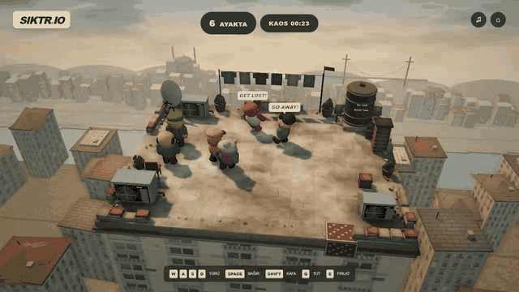
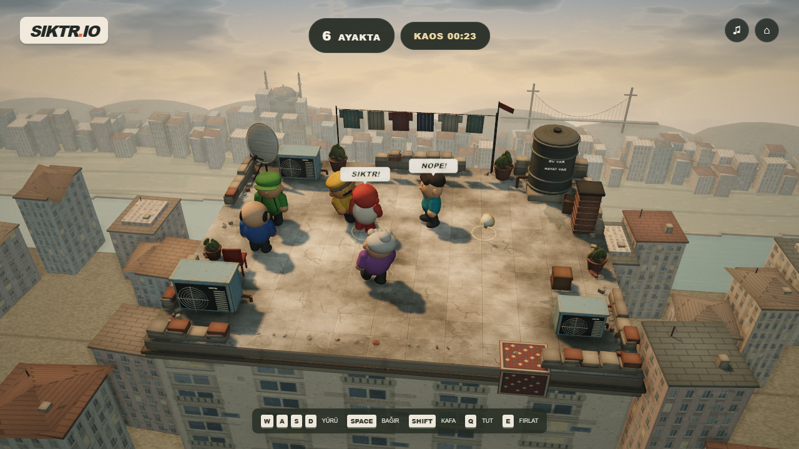
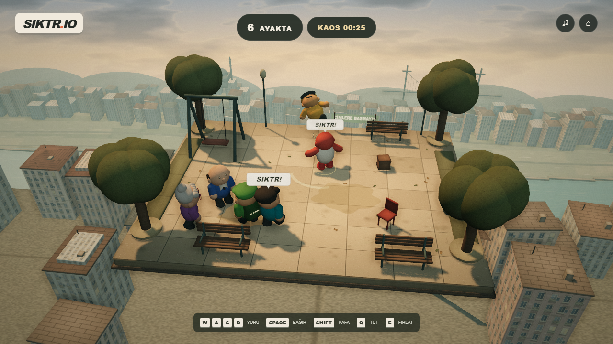

# SIKTR.IO

**Biraz bağır. Biraz itiş. Son kalan çayı içer.**

İstanbul'da geçen, son ayakta kalanın kazandığı fizik komedisi. Tek insan + beş bot, aynı klavyede iki kişi veya oyun kollarıyla yerel oyun.

**Yapımcı: [torunum](https://github.com/torunum)**



## Oyna

**`index.html` dosyasını tarayıcıda aç.** Oyun tek dosyanın içindedir; internet, sunucu veya indirilmiş model/görsel/ses gerekmez. WebGL 2 ve klavye destekli güncel bir masaüstü tarayıcısı kullan.

İsmini yaz, bir arena ve karakter seç, **OYNA**. Haritalar her raundun ardından değişir. Sadece aşağı düşmek eler; kazanan ekranından beş saniye sonra yeni raund başlar.

| Hareket | Oyuncu 1 | Oyuncu 2 / aynı klavye |
|---|---|---|
| Yürü | WASD | Ok tuşları |
| Yönel | Fare | Hareket yönü |
| Bağır | Space | Enter |
| Kafa at | Shift | / |
| Tut / bırak | Q | , |
| Fırlat | E | . |

Oyun kolu: sol çubuk yürü, sağ çubuk yönel, A bağır, X kafa, LB tut, RB fırlat. Kol çıkarılırsa ilgili oyuncuyu bot devralır. Escape duraklatır; F3 FPS ve çizim istatistiklerini gösterir. Ses, ilk OYNA hareketinden sonra başlar.

## Mahallede Neler Var?

- Çatı, minibüs, düğün salonu, internet kafe, metro, park; her birinde hareketli tehlike.
- Yedi kozmetik karakter; eşit kütle ve çarpışma boyutu.
- Bağırma konisi, geri tepme, kafa atma, tutma/fırlatma, parçalanan eşyalar, kaygan çay izleri.
- Megafon, terlik, çay ve döner; uyarılı kaos olayları.
- Canvas dokular, geometriden modeller, WebAudio ses sentezi; yarım çözünürlük SSAO, yumuşak gölgeler ve sahne derinliğine göre arka plan bulanıklığı.

### İstanbul Çatıları



### Mahalle Parkı



## Geliştirme

Node.js ile:

```sh
npm install
npm run dev
```

Yerel adres: `http://127.0.0.1:4173`.

```sh
npm test
npm run build
```

`npm test` gerçek simülasyon davranışını, deterministik yeniden oynatmayı, kontrolcü atamasını ve tek dosya paketini denetler. `npm run build` kaynakları ve Three.js'i yeniden tek `index.html` içine toplar. Kaynak klasörü yalnızca geliştirme içindir; oyunu paylaşmak için HTML dosyası yeterlidir.

`src/sim.js` dış kitaplık kullanmayan 60 Hz simülasyondur. Aynı başlangıç durumu ve sıralı girdiler aynı sonucu üretir. Görüntü ve ses katmanı ayrı çalışır. Çevrimiçi P2P henüz uygulanmadı; mevcut çok oyunculu mod yereldir. Küçük dekorlar çarpışmaz; ana duvarlar ve arena sınırları simüle edilir. Fizik, ticari bir ragdoll motoru yerine kapsül çarpışmaları ve altı yaylı gövde bölümü kullanır.

22 otomatik test geçiyor. Altı arena için mevcut tarayıcı kontrolleri, 90 bot maçının sonuçları ve test kapsamının sınırları [doğrulama notlarında](docs/verification.md).

## Yapımcı ve Lisans Notu

SIKTR.IO'nun yapımcısı **[torunum](https://github.com/torunum)**.

Three.js MIT lisansı ve ilgili telif bildirimleri, paketlenmiş JavaScript içinde korunur. Tam metin ayrıca [üçüncü taraf bildirimlerinde](THIRD_PARTY_NOTICES.txt) bulunur.
